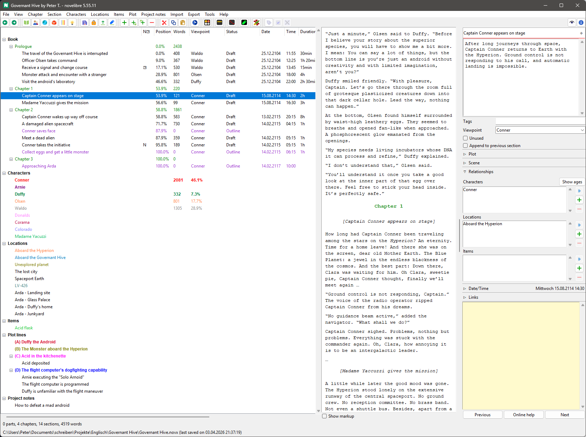

#  novelibre

*novelibre* is an application for novelists who prefer to write with the *Writer* 
word processor of LibreOffice or OpenOffice, but need additional features for the 
organization of their work. 

## Features

- With *novelibre*, extensive novels can be broken down into **parts, chapters, and sections**. 
- You can store data on **characters, locations, and items** that are important for the story. 
  This includes the optional definition of a **viewpoint character** for each section. 
- All of this appears as a clear and editable **tree** structure with listed information. 
- Summaries can be entered at all these levels, from which **synopses** and lists can be generated. 
- If you choose a **narrative structure**, *novelibre* can display stages (e.g. acts or steps) in the tree.
  When plotting, descriptions of these stages can be entered, from which *novelibre* can generate 
  its own documentation. Prefabricated structural models can also be imported from templates.
- *novelibre* also allows you to create and document an underlying structure of **plot lines** 
  (e.g. subplots or character arcs) apart from the chapters and sections. This can then be linked 
  to the sections of the novel text.
- *novelibre* povides a **plot grid** with plot line notes for each section. This allows you to 
  see the big picture and keep track of multiple subplots.   
- To keep track of progress, the **word count** and the **completion status** of the sections are displayed. 
- Individual chapters and sections can be flagged as "unused" to exclude them from document export.
- You can add information about the **narrative time** and duration to each section. If you enter a date, 
  the day of the week is displayed. You can also call up the age of characters that are assigned to
  a section. The date and time information can be synchronised with dedicated timeline software.
- For the **actual writing work**, *novelibre* starts the *Writer* word processor with 
  a structured manuscript in *Open Document Text* format *(.odt)*. At the end of a work cycle, *novelibre* 
  reimports the manuscript and updates the writing project. New chapters and sections can also be 
  created in the process.
- For **printing**, *novelibre* exports a neatly designed novel manuscript that can be formatted as 
  you wish applying *Writer* document templates. 
- *novelibre* saves its data in a well-documented, XML-based **file format** ([.novx](https://peter88213.github.io/novxlib-docs/the_novx_file_format.html)), which can also be read as 
  plain text and displayed with a standard web browser.
- *novelibre* is written in Python and should run on several **operating systems**, like Windows and Linux.
- The application is ready for internationalization with GNU gettext. German translations are provided. 

## Plugins

*novelibre's* functionality can be extended by plugins. Here are some examples:

- [A relationship matrix](https://github.com/peter88213/nv_matrix/)
- [A book/series collection manager](https://github.com/peter88213/nv_collection/)
- [An on-demand update checker](https://github.com/peter88213/nv_updater/)
- [A daily progress log viewer](https://github.com/peter88213/nv_progress/)
- [A Story Template management plugin](https://github.com/peter88213/nv_templates/)
- [A Timeline plugin](https://github.com/peter88213/nv_timeline/)
- [An Aeon Timeline 2 plugin](https://github.com/peter88213/nv_aeon2/)
- [A theme changer](https://github.com/peter88213/nv_themes/)
- [A yw7 file importer/exporter](https://github.com/peter88213/nv_yw7/)
- [A simple "markup" section editor](https://github.com/peter88213/nv_editor/)
- [A clipboard plugin](https://github.com/peter88213/nv_clipboard/)

## Tools

Stand-alone Python scripts for *novx* file conversion.

- [scap_novx](https://github.com/peter88213/scap_novx/): Generate a *novelibre* project from a *Scapple* outline.
- [novx_xtg](https://github.com/peter88213/novx_xtg/): XPress tagged text export from *novelibre* projects.

## Requirements

- [Python](https://www.python.org/) version 3.6+. 
     - For current Windows versions, use version 3.9.10 or above.
     - For Vista and Windows 7, use version 3.7.2.
     - Linux users: Make sure you have the *python3-tk* package installed.
- Either [LibreOffice](https://www.libreoffice.org/) or [OpenOffice](https://www.openoffice.org).

## General note about the fitness for use

At present, this program is still under active development. Therefore it is recommended to check for updates from time to time, as well as for the plugins. 

I use the program myself and fix errors immediately if I notice any. As far as I can tell, *novelibre* runs fast and reliably under Windows and Linux. It should also under other operating systems for which there is a reasonably up-to-date *Python 3* installation. However, there is a lack of a broad user base, which is why one cannot speak of real proven operation. 

## Download and install

[Download the latest release (version 4.3.4)](https://github.com/peter88213/novelibre/raw/main/dist/novelibre_v4.3.4.zip)

- Extract the "novelibre_v4.3.4" folder from the downloaded zipfile "novelibre_v4.3.4.zip".
- Move into this new folder and open "README.md" for further instructions.
- You may wish to install plugins; the [update checker](https://github.com/peter88213/nv_updater/) is highly recommended.

---

[Changelog](docs/changelog.md)

[News](https://github.com/peter88213/novelibre/discussions/1)

[Discussions](https://github.com/peter88213/novelibre/discussions)

## Usage

See the [instructions for use](docs/usage.md)

## Credits

- The logos and file icons are made using the free *Pusab* font by Ryoichi Tsunekawa, [Flat-it](http://flat-it.com/).
- The toolbar icons are based on the [Eva Icons](https://akveo.github.io/eva-icons/#/), published under the [MIT License](http://www.opensource.org/licenses/mit-license.php). The original black and white icons were colored for this plugin by the maintainer. 

## License

This is Open Source software, and *novelibre* is licensed under GPLv3. See the
[GNU General Public License website](https://www.gnu.org/licenses/gpl-3.0.en.html) for more
details, or consult the [LICENSE](https://github.com/peter88213/novelibre/blob/main/LICENSE) file.

The modules in the *widgets* package are licenced under the [MIT License](http://www.opensource.org/licenses/mit-license.php). 
