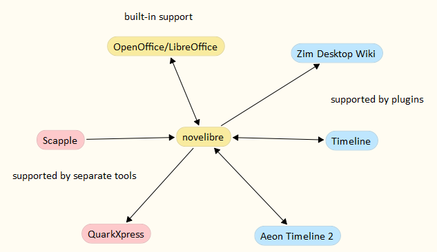

#  novelibre

*novelibre* helps novelists to plan extensive novels and to keep track of them
during creation and revision.

*novelibre* is designed for writers who are familiar with LibreOffice or OpenOffice. 

*novelibre* is an add-on to OpenOffice or LibreOffice that helps to break down
large novels into parts, chapters and sections, all of which are provided with
additional information called metadata.
The metadata remain permanently associated with the chapters and sections 
in the ODT manuscript throughout the work on the novel. 
*novelibre* makes information about the story world accessible and relates
characters, locations, and items to the sections.
*novelibre* can hold information about plot lines and plot points that are
assigned to the sections.

[Read more](https://peter88213.github.io/nvhelp-en/introduction.html) 
about the idea and purpose of novelibre. 

What distinguishes *novelibre* from other writing software is the integration 
of other applications into the workflow, which are powerful and proven. 
*novelibre* is not an "all-in-one" solution, but a novel organizer that
is embedded in a customizable ecosystem. 

## Features

- With *novelibre*, extensive novels can be broken down into **parts, chapters, and sections**. 
- You can store data on **characters, locations, and items** that are important for the story. 
  This includes the optional definition of a **viewpoint character** for each section. 
- All of this appears as a clear and editable **tree** structure with listed information. 
- Summaries can be entered at all these levels, from which **synopses** and lists can be generated. 
- If you choose a **narrative structure**, *novelibre* can display stages (e.g. acts or steps) in the tree.
  When plotting, descriptions of these stages can be entered, from which *novelibre* can generate 
  its own documentation. Prefabricated structural models can also be imported from templates.
- *novelibre* also allows you to create and document an underlying structure of **plot lines** 
  (e.g. subplots or character arcs) apart from the chapters and sections. This can then be linked 
  to the sections of the novel text.
- *novelibre* provides a **plot grid** with plot line notes for each section. This allows you to 
  see the big picture and keep track of multiple subplots.   
- To keep track of progress, the **word count** and the **completion status** of the sections are displayed. 
- Individual chapters and sections can be flagged as "unused" to exclude them from document export.
- You can add information about the **narrative time** and duration to each section. If you enter a date, 
  the day of the week is displayed. You can also call up the age of characters that are assigned to
  a section. The date and time information can be synchronised with dedicated timeline software.
- For the **actual writing work**, *novelibre* starts the *Writer* word processor with 
  a structured manuscript in *Open Document Text* format *(.odt)*. At the end of a work cycle, *novelibre* 
  reimports the manuscript and updates the writing project. New chapters and sections can also be 
  created in the process.
- For **printing**, *novelibre* exports a neatly designed novel manuscript that can be formatted as 
  you wish applying *Writer* document templates. 
- *novelibre* saves its data in a well-documented, XML-based **file format** ([.novx](https://peter88213.github.io/novxlib-docs/the_novx_file_format.html)), which can also be read as 
  plain text and displayed with a standard web browser.
- *novelibre* is written in Python and should run on several **operating systems**, like Windows and Linux.
- The application is ready for internationalization with GNU gettext. German translations are provided. 

## Plugins

In order not to overload the program with features, some of them are offered as plugins 
so that only those users who need them actually install them.

-  So if it's important to you to track characters, locations, items, and plot lines, 
   you might want to download and install the
   [nv_matrix](https://github.com/peter88213/nv_matrix/) plugin.
-  If you have more than one book project, or if you write a series, 
   you can easily switch between your *novelibre* projects using the 
   [nv_collection](https://github.com/peter88213/nv_collection/)
   book/series collection manager.
-  If you want to track your progress, you will love the 
   [nv_progress](https://github.com/peter88213/nv_progress/)
   daily word count log viewer.
-  If you value a balanced text distribution, the
   [nv_statistics](https://github.com/peter88213/nv_statistics/)
   statistics viewer could be something for you.
-  If you want to set up your stories according to a proven dramaturgical scheme, 
   you can conveniently load one into your project with the help of the 
   [nv_templates](https://github.com/peter88213/nv_templates/)
   story template manager.
-  If you do extensive world building using the free *Zim Desktop wiki*, you can connect it to *novelibre* with 
   the [nv_zim](https://github.com/peter88213/nv_zim) plugin.
-  If the course of the narrated time is important to you, there are various options for a better overview:
   - The [nv_tlview](https://github.com/peter88213/nv_tlview/) timeline viewer plugin,
   - the [nv_timeline](https://github.com/peter88213/nv_timeline/) file synchronizer for the free *Timeline* application, and 
   - the [nv_aeon2](https://github.com/peter88213/nv_aeon2/) file synchronizer for the commercial *Aeon Timeline 2* application.
-  Do you have Linux, and *novelibre* doesn't look fancy enough for you? 
   Take a look at the alternative themes supported by the 
   [nv_themes](https://github.com/peter88213/nv_themes/) plugin.
-  Eye pain because of *novelibre*? Not necessarily. Just try the experimental dark mode
   with [nv_dark](https://github.com/peter88213/nv_dark/).
-  If you want to switch between *yWriter* and *novelibre*, the
   [nv_yw7](https://github.com/peter88213/nv_yw7/)
   yw7 file importer/exporter plugin might come in handy.
-  Are you running an outdated version of *novelibre* and its plugins?
   Just launch the the on-demand update checker 
   [nv_updater](https://github.com/peter88213/nv_updater/)
   from time to time. 
-  If you are familiar with XML, you can edit or split your sections directly in *novelibre*
   with [nv_editor](https://github.com/peter88213/nv_editor/).

## Auxiliary scripts

Some tasks are very special and are rarely performed, 
perhaps only once at the start or end of a project. 
A Python script that can handle the *.novx* file format is then sufficient. 
Here are a few examples:

- If you use the commercial *Scapple* mind mapper, 
  you can create a sophisticated project outline and have 
  [scap_novx](https://github.com/peter88213/scap_novx/) 
  generate a *novelibre* project from it.
- If you are a self-publisher using commercial *Quark™ XPress* desktop publishing software,
  try [novx_xtg](https://github.com/peter88213/novx_xtg/) to export XPress tagged text 
  from your *novelibre* project.
- If you are the hands-on DIY type, you can create a wide variety of custom HTML documents
  from your *novelibre* project via the template-based 
  [novx_html](https://github.com/peter88213/novx_html/)
  HTML exporter.

## Requirements

- Screen resolution of at least 900 pixels in height.
- Windows or Linux. Mac OS support is experimental, see [discussion](https://github.com/peter88213/novelibre/discussions/29).
- [Python](https://www.python.org/) version 3.6+. 
     - For current Windows versions, use version 3.9.10 or above.
     - For Vista and Windows 7, use version 3.7.2.
     - Linux users: Make sure you have the *python3-tk* package installed. 
       To see the tooltips, make sure that you have the *idle3* package installed.
- Either [LibreOffice](https://www.libreoffice.org/) or [OpenOffice](https://www.openoffice.org).

## General note about the fitness for use

I use the program myself and fix bugs immediately if I notice any. As far as I can tell, *novelibre* runs fast and reliably under Windows and Linux. 
The development phase has now come to an end. Nevertheless it is recommended to check for updates from time to time, as well as for the plugins. 

[Changelog](docs/changelog.md)

[News](https://github.com/peter88213/novelibre/discussions/1?sort=new)

[Feedback](https://github.com/peter88213/novelibre/discussions)

## Download and install

### Default: Executable Python zip archive

Download the latest release [novelibre_v5.23.0.pyzw](https://github.com/peter88213/novelibre/raw/main/dist/novelibre_v5.23.0.pyzw)

- Launch *novelibre_v5.23.0.pyzw* by double-clicking (Windows/Linux desktop),
- or execute `python novelibre_v5.23.0.pyzw` (Windows), resp. `python3 novelibre_v5.23.0.pyzw` (Linux) on the command line.

#### Important

Many web browsers recognize the download as an executable file and offer to open it immediately. 
This starts the installation.

However, depending on your security settings, your browser may 
initially  refuse  to download the executable file. 
In this case, your confirmation or an additional action is required. 
If this is not possible, you have the option of downloading 
the zip file. 

### Alternative: Zip file

The package is also available in zip format: [novelibre_v5.23.0.zip](https://github.com/peter88213/novelibre/raw/main/dist/novelibre_v5.23.0.zip)

- Extract the *novelibre_v5.23.0* folder from the downloaded zipfile "novelibre_v5.23.0.zip".
- Move into this new folder and launch *setup.pyw* by double-clicking (Windows/Linux desktop), 
- or execute `python setup.pyw` (Windows), resp. `python3 setup.pyw` (Linux) on the command line.

You may wish to install plugins; the [update checker](https://github.com/peter88213/nv_updater/) is highly recommended.

---

## Usage

See the [online user guide](https://peter88213.github.io/nvhelp-en/)

## Credits

- The logos and file icons are made using the free *Pusab* font by Ryoichi Tsunekawa, [Flat-it](http://flat-it.com/).
- The toolbar icons are based on the [Eva Icons](https://akveo.github.io/eva-icons/#/), published under the [MIT License](http://www.opensource.org/licenses/mit-license.php). The original black and white icons were colored for this application by the maintainer. 

## See also

### OpenOffice/LibreOffice extensions

*Writer* macros that may come in handy when editing your manuscript.

- [novelibre-tools](https://github.com/peter88213/novelibre-tools/):
  OpenOffice/LibreOffice extension for processing documents 
  in connection with *novelibre*.
- [StyleSwitcher](https://peter88213.github.io/StyleSwitcher/):
  Quickly switch between the style sheets of different document templates. 
- [curly](https://peter88213.github.io/curly/):
  Conversion of "curly quotes", 
  typographical apostrophes, ellipses and so on
  in several languages.
- [emph](https://peter88213.github.io/emph/):
  Use character styles instead of direct formatting to mark up text.

## License

This is Open Source software, and *novelibre* is licensed under GPLv3. See the
[GNU General Public License website](https://www.gnu.org/licenses/gpl-3.0.en.html) for more
details, or consult the [LICENSE](https://github.com/peter88213/novelibre/blob/main/LICENSE) file.

The modules in the *widgets* package are licenced under the [MIT License](http://www.opensource.org/licenses/mit-license.php). 
