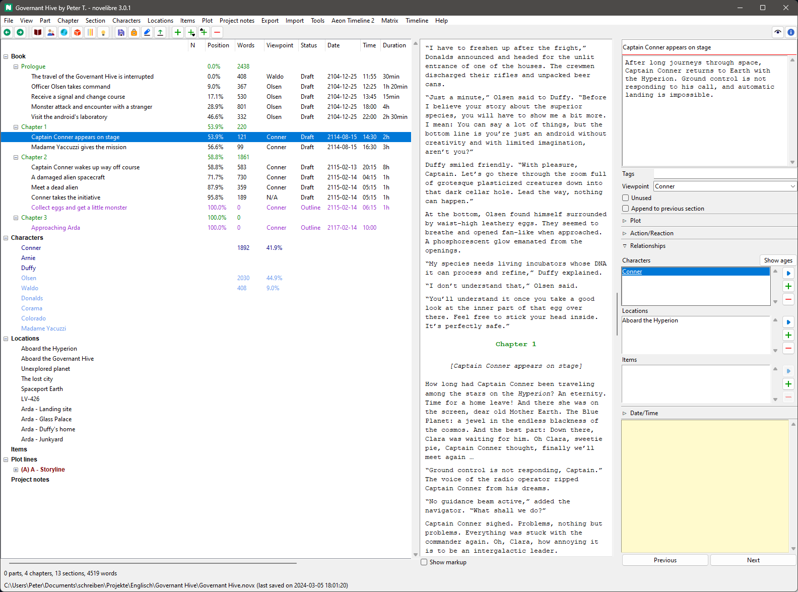

#  noveltree

*noveltree* is an organizer tool for writing novels with *LibreOffice Writer* or *OpenOffice Writer*. The entire novel is stored in a single file with all additional information. The manuscript is exported for editing with *Office Writer*, and then written back so that everything is always consistent and in one place. *noveltree* uses its own XML file format. 

*noveltree* is written in Python and should run on several operating systems, like Windows and Linux.

*noveltree* is to replace the [novelyst](https://peter88213.github.io/novelyst/) application. 
The main differences are an improved workflow that doesn't require a LibreOffice/OpenOffice extension, and the use of a new file format instead of the *.yw7* format. For more details see the [comparison between noveltree and novelyst](https://github.com/peter88213/noveltree/discussions/2).

If you are considering switching from *novelyst* to *noveltree*, the 
[nv_yw7 plugin](https://github.com/peter88213/nv_yw7/) will help you to
create *.novx* files from your existing projects. To migrate entire collections or larger amounts of project files,
you might want to take a look at the [yw_novx conversion tools](https://github.com/peter88213/yw_novx).

## Features

- The entire project is displayed in a tree, with branches for the book, characters, locations, items, arcs, and project notes.
- Tree elements can be added, moved, and deleted.
- There are three levels: part, chapter, and section.
- The right sidebar displays the essential properties of the selected element for editing.
- A text viewer window can be toggled on and off.
- There is a wide range of ODF-type file export for *OpenOffice* and *LibreOffice*.
- The exported ODT manuscript and several other exported documents can be re-imported to update the project.
- Several reports can be presented in list form. 
- The application is ready for internationalization with GNU gettext. A German localization is provided. 

## Plugins

*noveltree's* functionality can be extended by plugins. Here are some examples:

- [A yw7 file importer/exporter](https://github.com/peter88213/nv_yw7/)
- [An on-demand update checker](https://github.com/peter88213/nv_updater/)
- [A daily progress log viewer](https://github.com/peter88213/nv_progress/)
- [A book/series collection manager](https://github.com/peter88213/nv_collection/)
- [A relationship matrix](https://github.com/peter88213/nv_matrix/)
- [A Timeline plugin](https://github.com/peter88213/nv_timeline/)
- [An Aeon Timeline 2 plugin](https://github.com/peter88213/nv_aeon2/)
- [A theme changer](https://github.com/peter88213/nv_themes/)
- [A Story Template management plugin](https://github.com/peter88213/nv_templates/)
- [A simple "markup" section editor](https://github.com/peter88213/nv_editor/)

## Tools

Stand-alone Python scripts for *novx* file conversion.

- [scap_novx](https://github.com/peter88213/scap_novx/): Generate a *noveltree* project from a *Scapple* outline.
- [novx_xtg](https://github.com/peter88213/novx_xtg/): XPress tagged text export from *noveltree* projects.

## Requirements

- [Python](https://www.python.org/) version 3.6+. 
     - For current Windows versions, use version 3.9.10 or above.
     - For Vista and Windows 7, use version 3.7.2.
- Tk support for Python. This is usually part of the Windows Python installation, but may need to be installed additionally under Linux.
- Either [LibreOffice](https://www.libreoffice.org/) or [OpenOffice](https://www.openoffice.org).

### Note for Linux users

Please make sure that your Python3 installation has the *tkinter* module. On Ubuntu, for example, it is not available out of the box and must be installed via a separate package named *python3-tk*. 

## General note about the fitness for use

At present, this program is still under active development. Therefore it is recommended to check for updates from time to time, as well as for the plugins. 

I use the program myself and fix errors immediately if I notice any. As far as I can tell, *noveltree* runs fast and reliably under Windows and Linux. It should also under other operating systems for which there is a reasonably up-to-date *Python 3* installation. However, there is a lack of a broad user base, which is why one cannot speak of real proven operation. 

## Download and install

[Download the latest release (version 1.8.0)](https://github.com/peter88213/noveltree/raw/main/dist/noveltree_v1.8.0.zip)

- Extract the "noveltree_v1.8.0" folder from the downloaded zipfile "noveltree_v1.8.0.zip".
- Move into this new folder and open "README.md" for further instructions.
- You may wish to install plugins; the [section editor](https://github.com/peter88213/nv_editor/) is highly recommended.

---

[Changelog](docs/changelog.md)

[News](https://github.com/peter88213/noveltree/discussions/1)

[Discussions](https://github.com/peter88213/noveltree/discussions)

## Usage

See the [instructions for use](docs/usage.md)

## Credits

The app icons are made using the free *Pusab* font by Ryoichi Tsunekawa, [Flat-it](http://flat-it.com/).
The toolbar icons are based on the [Eva Icons](https://akveo.github.io/eva-icons/#/), published under the [MIT License](http://www.opensource.org/licenses/mit-license.php). The original black and white icons were colored for this plugin by the maintainer. 

## License

This is Open Source software, and *noveltree* is licensed under GPLv3. See the
[GNU General Public License website](https://www.gnu.org/licenses/gpl-3.0.en.html) for more
details, or consult the [LICENSE](https://github.com/peter88213/noveltree/blob/main/LICENSE) file.

The modules in the *widgets* package are licenced under the [MIT License](http://www.opensource.org/licenses/mit-license.php). 
