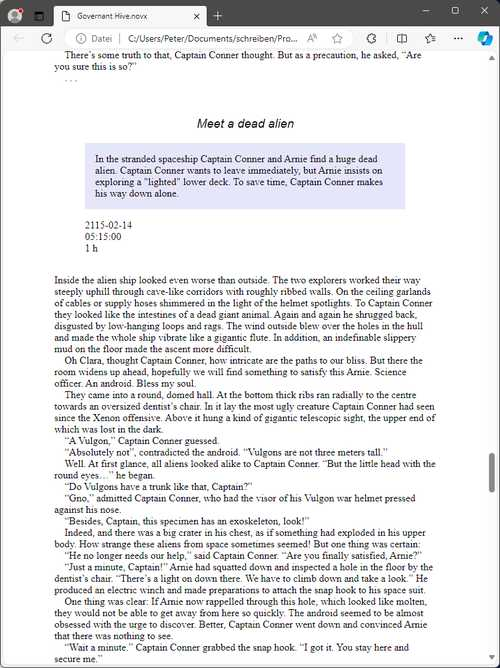

# A stylesheet for viewing novx files with a web browser

1. Copy *novx.css* into your project directory.
2. Open your *<project name>.novx* file with your web browser.

**Note:** Depending on your web browser and your operating system, 
the *content type* resp. *MIME type* of *.novx* files must be
registered as *"text/xml"*. Under Windows, yo can do this by
running the **<home>\.novx\add_novelibre.reg** script.

This is an example with the "Edge" browser.