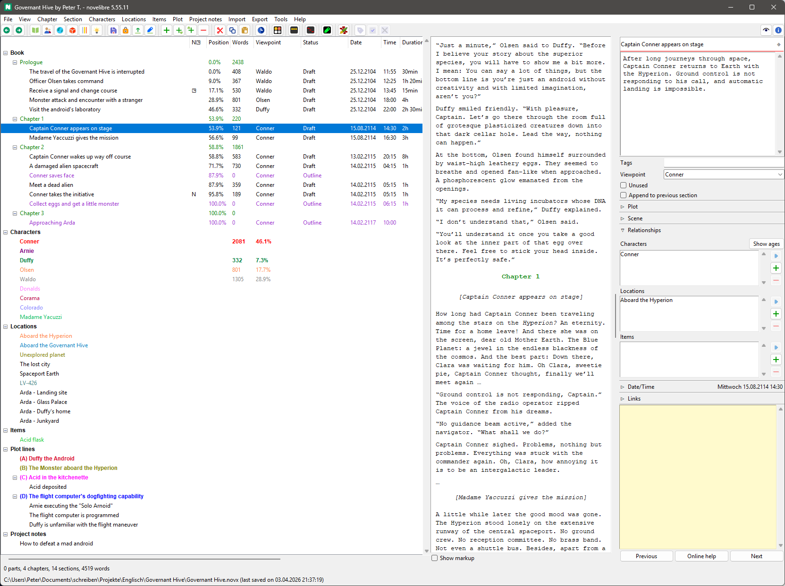
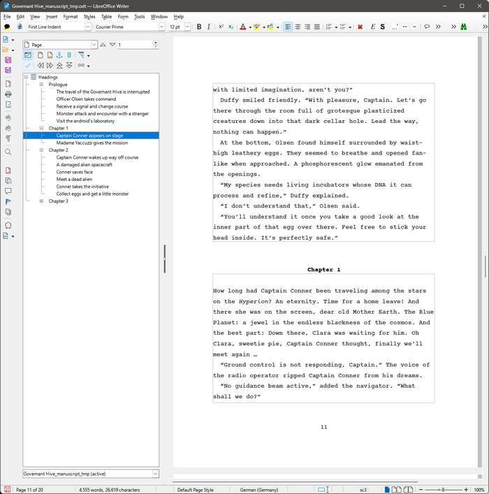

[Home page](https://github.com/peter88213/novelibre) > German page

---

#   novelibre

*novelibre* hilft Romanautoren dabei, 
umfangreiche Romane zu planen und während des Schreibens und Überarbeitens 
den Überblick zu behalten.

*novelibre* ist für Autoren gedacht, die mit OpenOffice oder LibreOffice vertraut sind.

*novelibre* ist eine Ergänzung zu OpenOffice oder LibreOffice, die dabei hilft, 
umfangreiche Romane in Teile, Kapitel und Abschnitte zu unterteilen, die alle mit 
zusätzlichen Informationen, sogenannten Metadaten, versehen sind.  
Die Metadaten bleiben während der gesamten Arbeit an dem Roman dauerhaft mit 
den Kapiteln und Abschnitten im ODT-Manuskript verknüpft.
*novelibre* macht Informationen über die Erzählwelt zugänglich und verknüpft Figuren, 
Schauplätze und Gegenstände mit den Abschnitten.
*novelibre* kann Informationen über Plotlinien und Plotpunkte erfassen, die 
den Abschnitten zugeordnet sind.

[Erfahren Sie mehr](https://peter88213.github.io/nvhelp-de/introduction.html) 
über die Idee und den Zweck von novelibre. 

So sieht der Arbeitsbereich von *novelibre* aus:

Hier ist das Manuskript, an dem gearbeitet werden soll. 
*novelibre* hat es erstellt und an OpenOffice *Writer* weitergereicht:

Wenn die Systemsprache Ihres Computers Deutsch ist, erscheinen die Benutzeroberfläche 
und die Online-Hilfe von *novelibre* ebenfalls in deutscher Sprache. 
Das Benutzerhandbuch liegt komplett auf Deutsch vor. 

## Merkmale

- Die Benutzung von novelibre ist kostenlos, und der Quellcode ist frei zugänglich.
- Mit novelibre lassen sich umfangreiche Romane in **Teile, Kapitel und Abschnitte** unterteilen.
- Sie können Daten zu **Figuren, Schauplätzen und Gegenständen** speichern, die für die Handlung wichtig sind. Dazu gehört auch die optionale Festlegung einer **Perspektive** für jeden Abschnitt.
- All dies wird als übersichtliche und bearbeitbare **Baumstruktur** mit aufgelisteten Informationen dargestellt.
- Auf allen Ebenen können Beschreibungen eingegeben werden, aus denen sich **Zusammenfassungen** und Tabellen generieren lassen.
- Wenn Sie eine **Erzählstruktur** wählen, kann novelibre Stadien (z. B. Akte oder Schritte) im Baum anzeigen. Beim Plotten können Beschreibungen dieser Phasen eingegeben werden, aus denen novelibre eine eigene Dokumentation generieren kann. Vorgefertigte Strukturmodelle können auch aus Vorlagen importiert werden.
- Mit novelibre können Sie außerdem unabhängig von den Kapiteln und Abschnitten eine zugrunde liegende Struktur von **Plotlinien** (z. B. Nebenhandlungen oder Charakterentwicklungen) erstellen und dokumentieren. Diese kann dann mit den Abschnitten des Romantextes verknüpft werden.
- novelibre bietet für jeden Abschnitt ein **Handlungsraster** mit Notizen zu den Plotlinien. So behalten Sie den Überblick und können mehrere Handlungsstränge im Blick behalten.
- Um den Fortschritt im Blick zu behalten, werden die **Wortzahl** und der **Fertigstellungsstatus** der Abschnitte angezeigt.
- Einzelne Kapitel und Abschnitte können als „unbenutzt“ markiert werden, um sie vom Dokumentenexport auszuschließen.
- Sie können zu jedem Abschnitt Angaben zum **Zeitpunkt** und zur **Dauer der Handlung** hinzufügen. Wenn Sie ein Datum eingeben, wird der Wochentag angezeigt. Außerdem können Sie das Alter der Figuren abrufen, die einem Abschnitt zugeordnet sind. Die Datums- und Zeitangaben lassen sich mit spezieller Zeitleistensoftware synchronisieren.
- Für die **eigentliche Schreibarbeit** startet novelibre das Textverarbeitungsprogramm *Writer* mit einem strukturierten Manuskript im Open-Document-Text-Format (.odt). Am Ende eines Arbeitszyklus importiert novelibre das Manuskript erneut und aktualisiert das Schreibprojekt. Dabei können auch neue Kapitel und Abschnitte erstellt werden.
- Zum **Drucken** exportiert novelibre ein übersichtlich gestaltetes Romanmanuskript, das mithilfe von *Writer*-Dokumentvorlagen nach Belieben formatiert werden kann.
- novelibre speichert seine Daten in einem gut dokumentierten, XML-basierten **Dateiformat** ([.novx](https://peter88213.github.io/novxlib-docs/the_novx_file_format.html)), das auch als Klartext gelesen und mit einem Standard-Webbrowser angezeigt werden kann.
- novelibre ist in der Programmiersprache Python geschrieben und sollte auf verschiedenen **Betriebssystemen** wie Windows und Linux laufen.
- Die novelibre-Download-Datei ist ein zip-komprimierter reiner Quellcode mit **sehr geringer Größe und geringem Speicherbedarf**.
- novelibre **arbeitet vollständig offline**. Nur die Online-Hilfe und das optionale On-Demand-Updater-Plugin erfordern eine Internetverbindung.
- Die Entwicklung des novelibre-Codes geschieht **ohne „Künstliche Intelligenz“**. Auch im Betrieb kommt keine zum Einsatz.
- Eine vollständige **deutsche Übersetzung** der Benutzeroberfläche und der Ausgabedokumente ist vorhanden.

## Plugins

Damit die vielen Funktionen das Programm nicht überladen, werden einige als Plugins angeboten, so dass nur diejenigen Benutzer sie installieren, die sie auch tatsächlich brauchen. 

-  Wenn es Ihnen also wichtig ist, Figuren, Schauplätze, Gegenstände und Plotlinien zu verfolgen,
   sollten sie das
   [nv_matrix](https://github.com/peter88213/nv_matrix/)-Plugin installieren.
-  Falls Sie mehr als ein Buchprojekt haben, oder eine Serie schreiben,
   können Sie mit der [nv_collection](https://github.com/peter88213/nv_collection/)-Bücher/Serienverwaltung
   leicht zwischen Ihren *novelibre*-Projekten wechseln.
-  Wenn Sie Ihren Schreibfortschritt verfolgen wollen, wird Ihnen die tägliche Wortzahlansicht von 
   [nv_progress](https://github.com/peter88213/nv_progress/) gefallen.
-  Das [nv_snapshots](https://github.com/peter88213/nv_snapshots/)-Plugin ist ein leichtgewichtiges Versionskontrollsystem.
-  Wollen Sie sich beim Schreiben ganz und gar auf Ihren Text konzentrieren? Dann probieren Sie das 
   [nv_writer](https://github.com/peter88213/nv_writer/)-Plugin aus, 
   das einen ablenkungsfreien Schreibmodus bietet, in dem Sie Szene für Szene eintippen können,
   als hätten Sie eine Schreibmaschine oder eine DOS-Textverarbeitung.
-  Haben Sie einen E-Reader? Dann lassen Sie den [nv_epub](https://github.com/peter88213/nv_epub/)-Exporter ein EPUB-Ebook erzeugen,
   entweder für den persönlichen Gebrauch oder als Grundlage für die Veröffentlichung. 
-  Wenn Ihnen etwas an einer ausgewogenen Textverteilung liegt, könnte die
   [nv_statistics](https://github.com/peter88213/nv_statistics/)-Statistikanzeige etwas für Sie sein. 
-  Falls Sie Ihre Geschichten entsprechend einem bewährten dramaturgischen Schema anlegen wollen, 
   können Sie mit Hilfe der [nv_templates](https://github.com/peter88213/nv_templates/)-Geschichtenvorlagenverwaltung
   bequem eines in Ihr Projekt laden.
-  Wenn Sie das freie *Zim Desktop wiki* für umfangreichen Weltenbau benutzen, können Sie es mit dem
   [nv_zim](https://github.com/peter88213/nv_zim)-Plugin an *novelibre* anbinden. 
-  Falls für Sie der Verlauf der erzählten Zeit wichtig ist, gibt es mehrere Möglichkeiten, einen besseren Überblick zu bekommen:
   - Das [nv_tlview](https://github.com/peter88213/nv_tlview/) Zeitleistenbetrachter-Plugin,
   - den [nv_timeline](https://github.com/peter88213/nv_timeline/) Dateisynchronisierer für die freie *Timeline*-Anwendung, und 
   - den [nv_aeon2](https://github.com/peter88213/nv_aeon2/) Dateisynchronisierer für das kommerzielle *Aeon Timeline 2*.
-  Haben Sie Linux, und *novelibre* sieht für Sie nicht schick genug aus? 
   Senen Sie sich die alternativen Themes an, die vom 
   [nv_themes](https://github.com/peter88213/nv_themes/)-Plugin unterstützt werden.
-  Augenschmerzen wegen *novelibre*? Das muss nicht sein. Probieren Sie einfach den experimentellen dark mode
   aus mit [nv_dark](https://github.com/peter88213/nv_dark/).
-  Falls Sie zwischen *yWriter* und *novelibre* wechseln wollen, könnte das
   [nv_yw7](https://github.com/peter88213/nv_yw7/)
   yw7-Dateiimport/Export-Plugin praktisch sein.
-  Wollen Sie sicherstellen, dass Sie auch die neueste Version von *novelibre* und seinen Plugins installiert haben?
   Starten Sie einfach von Zeit zu Zeit den Update-Checker 
   [nv_updater](https://github.com/peter88213/nv_updater/). 
-  Wenn Sei sich mit XML auskennen, können Sie Ihre Abschnitte mit
   [nv_editor](https://github.com/peter88213/nv_editor/) direkt in *novelibre* bearbeiten oder teilen. 
-  Wollen Sie Ihren Kapiteln oder Abschnitten im fertigen Dokument Metadaten wie
   Datum, Zeit oder Perspektivfigur voranstellen?
   Dann können Sie benutzerdefinierte Exportvorlagen erstellen und vom
   [nv_custom_export](https://github.com/peter88213/nv_custom_export/)- Plugin
   automatisch anwenden lassen.

Hier geht es zur englischsprachigen 
[Liste aller Plugins](https://github.com/peter88213/novelibre/blob/main/docs/plugins.md).

## Hilfsskripte

Manche Aufgaben sind sehr speziell und werden selten ausgeführt, 
vielleicht einmal zu Beginn oder Ende des Projekts. 
In diesem Fall genügt ein Python-Skript, welches das *.novx*-Dateiformat verarbeiten kann. 
Hier sind einige Beispiele:

- Wenn Sie den kommerziellen *Scapple*-Mindmapper verwenden, 
  können Sie damit eine ausgefeilte Gliederung erstellen und 
  [scap_novx](https://github.com/peter88213/scap_novx/) 
  ein *novelibre*-Project daraus generieren lassen.
- Falls Sie als Selfpublisher die kommerzielle *QuarkXPress™*-Desktop publishing-Software benutzen,
  probieren Sie doch  [novx_xtg](https://github.com/peter88213/novx_xtg/) aus, um XPress tagged text 
  aus Ihrem *novelibre*-Projekt zu erzeugen.
- Bastler und Selbermacher können aus ihrem *novelibre*-Projekt
  eine Vielzahl verschiedener HTML-Dokumente über den vorlagenbasierten 
  [novx_html](https://github.com/peter88213/novx_html/)
  HTML-Exportierer erzeugen.

---

## Anforderungen 

- Bildschirmauflösung: mindestens 900 Pixel in der Höhe.
- Windows oder Linux. Die Unterstützung für Mac OS is noch experimentiell, siehe [Diskussion](https://github.com/peter88213/novelibre/discussions/29).
- [Python](https://www.python.org/) Version 3.7+.
   - Unter **Windows 8-11** benutzen Sie bitte Version 3.9.10 oder neuer.
   - Unter **Vista und Windows 7** benötigen Sie Version 3.7.2.
   - **Linux**-Benutzer: Stellen Sie sicher, dass die tkinter-Unterstützung für Python 3 installiert ist. Für Ubuntu heißt das Paket *python3-tk*, für Fedora könnte es *python3-tkinter* heißen.
- Entweder [LibreOffice](https://www.libreoffice.org/) oder [OpenOffice](https://www.openoffice.org/). 

## Allgemeiner Hinweis zur Gebrauchstauglichkeit

Ich benutze das Programm selbst und behebe Fehler sofort, wenn mir welche auffallen. Soweit ich sagen kann, läuft *novelibre* flott und zuverlässig unter Windows und Linux. Die Entwicklungsphase ist beendet. Trotzdem wird empfohlen, von Zeit zu Zeit nach Updates zu sehen, auch für die Plugins. 

---

## Links

- [Benutzerhandbuch](https://peter88213.github.io/nvhelp-de/) 
- [Download-Seite (Englisch)](https://github.com/peter88213/novelibre#get-the-latest-release) 
- [Feedback geben oder eine Frage stellen (Englisch)](https://github.com/peter88213/novelibre/discussions)

---

## Nachweise

- Das novelibre-Logo wurde mit Hilfe der freien Schriftart *Pusab* von Ryoichi Tsunekawa, [Flat-it](http://flat-it.com/), erstellt.
- Das Flaggensymbol stammt von [Flaticon.com](https://www.flaticon.com/free-icons/flag).

---

## Lizenz

Dies ist Open Source Software, und *novelibre* steht unter der GPLv3-Lizenz. 
Einzelheiten finden Sie auf der
[GNU General Public License website](https://www.gnu.org/licenses/gpl-3.0.en.html), 
oder in der [LICENSE](https://github.com/peter88213/novelibre/blob/main/LICENSE)-Datei.

[Deutsche Übersetzung der Lizenz](https://www.gnu.de/documents/gpl.de.html)

