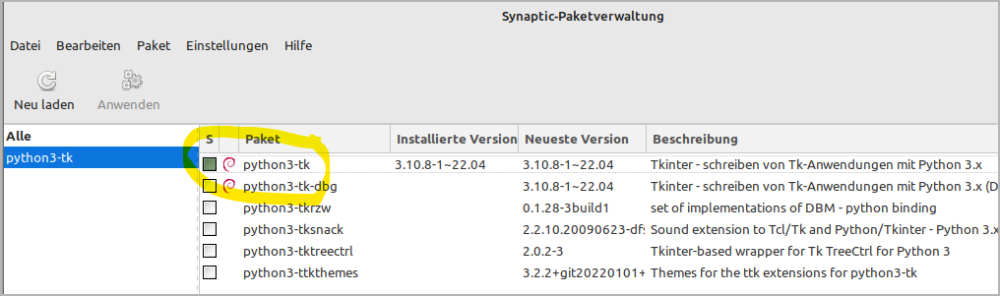
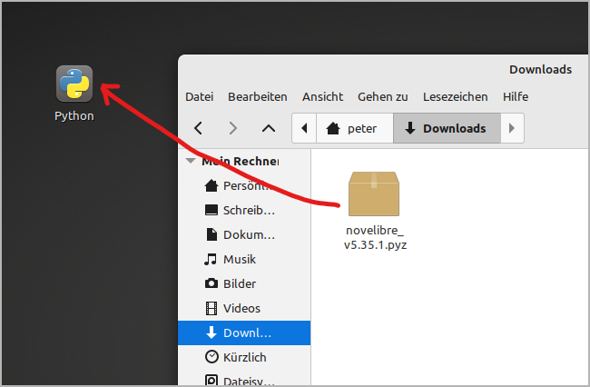
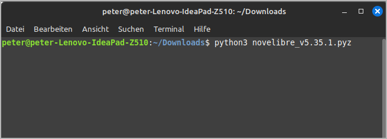
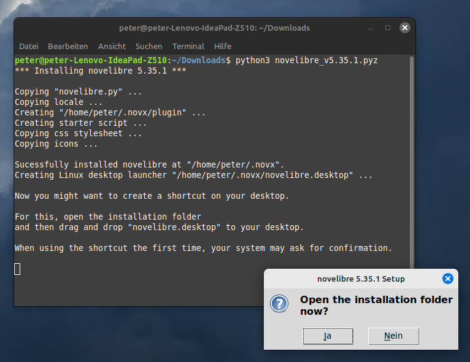
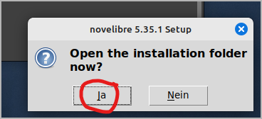
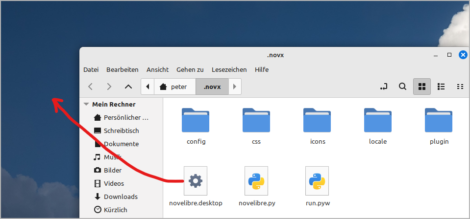
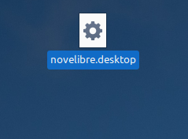
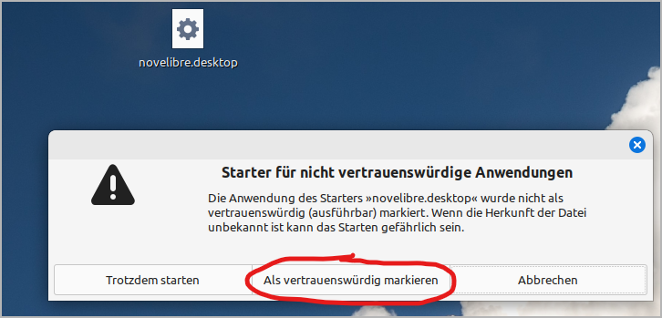
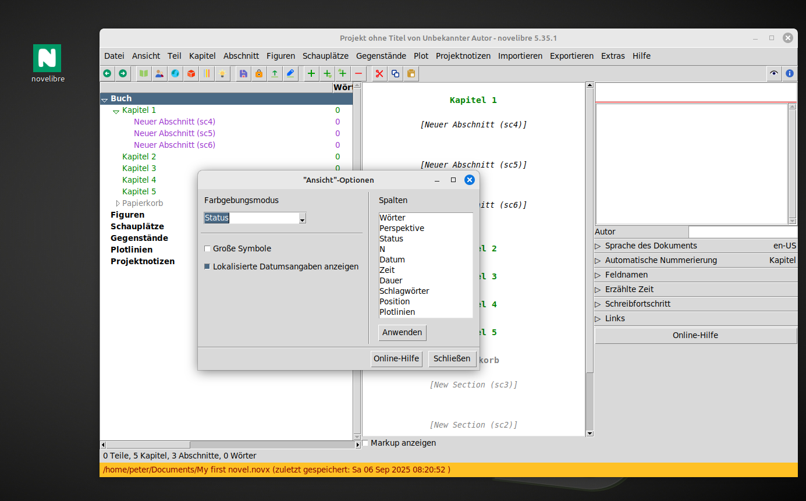
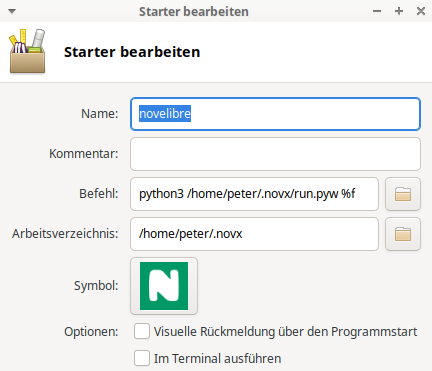

- [Homepage](https://github.com/peter88213/novelibre) 
- [Benutzerhandbuch](https://peter88213.github.io/nvhelp-de/) 

[English](../../setup_linux)

------------------------------------------------------------------------

# Installation unter Linux

> **Wichtig**
> 
> *novelibre* erhalten Sie als Quellcode in der Programmiersprache
> *Python*. Die meisten Linux-Distributionen haben Python bereits
> installiert, das zur Programmausführung benötigt wird. Stellen Sie
> jedoch sicher, dass Sie Python in der Version 3.7 oder höher haben. Ist
> das nicht der Fall, wäre das ein Anlass, Ihre Distribution zu
> aktualisieren.

Bevor Sie *novelibre* unter **Linux** installieren können, müssen Sie
sicherstellen, dass die auf der Projekt-Homepage genannten
Voraussetzungen erfüllt sind. Insbesondere muss auf Ihrem System die
Unterstützung für *tkinter* installiert sein. Für Ubuntu, Mint und
OpenSuse heißt das Paket z.B. **python3-tk**, für Fedora sollte es
**python3-tkinter** sein.

Starten Sie einfach Ihre Paketverwaltung und suchen Sie nach dem
entsprechenden Paket. Hier ist ein Beispiel für Linux Mint:

Lassen Sie dieses Paket, falls nötig, installieren, bevor Sie mit der
Installation von *novelibre* beginnen.

Die eigentliche Installation von *novelibre* ist einfach und
unkompliziert. Dabei legt das Installationsprogramm automatisch ein
Installationsverzeichnis an, kopiert alles Nötige hinein, und erzeugt
eine für den jeweiligen Rechner angepasste Startdatei namens
**run.pyw**, die man aufrufen muss, um *novelibre* auszuführen.

Die notwendige Handarbeit besteht darin, diese Startdatei mit dem
Desktop zu verknüpfen.

## Das Programm installieren

### Schritt 1

-   Ziehen Sie entweder entweder die heruntergeladene Datei
    **novelibre_vx.x.x.pyz** auf den Python-Programmstarter,

    

-   oder öffnen Sie eine Konsole im Download-Verzeichnis und führen
    Sie `python3 novelibre_vx.x.x.pyz` aus.

    

*"x.x.x"* ist dabei die Versionsnummer.

In beiden Fällen sollte eine Erfolgsmeldung erscheinen.

> **Hinweis**
>
>  Falls Sie keinen Python-Programmstarter eingerichtet haben, können
> Sie den von mir auf der *novelibre*-Homepage bereitgestellten
> herunterladen. Platzieren Sie ihn entweder auf Ihrem Linux-Desktop
> oder im Download-Verzeichnis. Das lohnt sich im Hinblick auf die
> Installation von Plugins und Updates.

## novelibre auf den Desktop bringen

### Schritt 2

Öffnen Sie das Installationsverzeichnis.

### Schritt 3

Ziehen Sie **novelibre.desktop** mit der Maus auf den Desktop.

Das erzeugt einen Programmstarter, um *novelibre* vom Desktop
aufzurufen.

### Schritt 4

Beim ersten Anklicken (oder Doppelklicken) könnte eine Warnmeldung
erscheinen, um zu verhindern, dass Sie versehentlich eine
ausführbare Datei installieren.

Wenn Sie den Programmstarter als vertrauenswürdig markieren,
verändert sich das Symbol unter Linux Mint zum
*novelibre*-Programmlogo, und Sie können die Applikation durch
Anklicken starten.

Nun können Sie *.novx*-Dateien auch auf diese Verknüpfung ziehen.

> **Hinweis**
>
> Falls die Schritte 2 bis 4 auf Ihrem Linux-Desktop nicht funktionieren,
> müssen Sie den Programmstarter selbst einrichten. Es geht darum,
> **python3** mit **/home/Ihr-Benutzername/.novx/run.pyw** und einer
> optional angegebenen Datei als Parameter zu starten. Sie erhalten ein
> Programmsymbol auf Ihrem Desktop, das Sie anklicken können, und auf das
> Sie Ihre *.novx*-Projektdatei zum Öffnen ziehen können.
> 
> Mit dem XFCE-Desktop, zum Beispiel, lautet mein Befehl im Starter:
> 
> `python3 /home/peter/.novx/run.pyw %f`
> 
> 
> 
> Vielleicht müssen Sie die *novelibre*-Icons in ein spezielles
> Bilderverzeichnis kopieren, wo der Programmstarter die Programmsysmbole
> sucht. Schauen Sie im Zweifelsfall in Ihre Desktop-Dokumentation.
> 
> Wenn Sie erfolgreich sind, können Sie Ihre Erfahrungen gern im
> [novelibre-Diskussionsforum](https://github.com/peter88213/novelibre/discussions)
> teilen.

### Schritt 5

Es ist eine gute Idee, die *novx*-Erweiterung in den mimetypes als
**text/xml** zu registrieren, dann kann Ihr Webbrowser sie mit Hilfe
des [novx.css-Stylesheets](file_menu.html#style-sheet-kopieren)
darstellen.

## Das Programm oder ein Plugin aktualisieren

Führen Sie einfach den Schritt 1 wie oben beschrieben aus. Sollten
weitere Handlungen nötig sein, erhalten Sie eine Meldung vom
Setup-Skript.
