[English](../../setup_windows)

------------------------------------------------------------------------

# Installation unter Windows

> **Wichtig**
> 
> *novelibre* erhalten Sie als Quellcode in der Programmiersprache
> *Python*. Um das Programm ausführen zu können, muss Python auf Ihrem PC
> installiert sein. Python kann über verschiede Wege kostenlos bezogen
> werden. Ich empfehle auf jeden Fall die Website der Entwickler:
> 
> <https://www.python.org/>
> 
> Python wird laufend weiterentwickelt und verbessert. Sie brauchen Ihre
> Python-Installation jedoch nicht zu aktualisieren, so lange *novelibre*
> damit funktioniert.

> **Anmerkung**
> 
> Dateien mit der Endung **.py**, **.pyw** und **.pyz** sind
> Python-Programme zum Ausführen. Wenn Sie eine solche Datei im
> Windows-Explorer doppelklicken, muss der installierte Python-Interpreter
> starten, und nichts anderes. Ist das nicht der Fall, haben Sie Python
> eventuell nicht vollständig installiert.
> 
> Falls Sie sich nicht sicher sind, können Sie in den
> Windows-Einstellungen nachsehen, ob die Zuordnung stimmt. Unter Windows
> 11 gehen Sie dazu in die Einstellungen. Die Zuweisungen sollten
> folgendermaßen aussehen:
> 
> 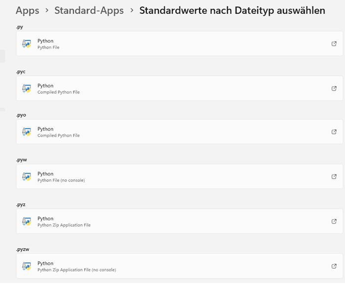

Die eigentliche Installation von *novelibre* ist einfach und
unkompliziert. Dabei legt das Installationsprogramm automatisch ein
Installationsverzeichnis an, kopiert alles Nötige hinein, und erzeugt
eine für den jeweiligen Rechner angepasste Startdatei namens
**run.pyw**, die man aufrufen muss, um *novelibre* auszuführen.

Die notwendige Handarbeit besteht darin, diese Startdatei mit dem
Desktop zu verknüpfen und, falls gewünscht, der Verknüpfung ein
Programmsymbol zuzuweisen. Außerdem zeige ich, wie man es unter Windows
einrichtet, dass die *novelibre*-Projektdateien ein eigenes
Programmsysmbol erhalten, und dass beim Doppelklicken darauf die
Programmanwendung gestartet wird.

Mit meinen einfachen Mitteln kann ich das leider nicht automatisieren,
ohne Probleme mit den Sicherheitsmechanismen des Betriebssystems zu
bekommen.

## Das Programm installieren

### Schritt 1

-   Starten Sie entweder die heruntergeladene Datei
    **novelibre_vx.x.x.pyz** durch Doppelklick,

    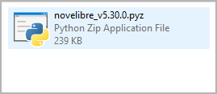

-   oder führen Sie `python novelibre_vx.x.x.pyz` auf der
    Kommandozeile aus.

    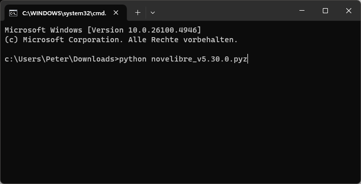

*"x.x.x"* ist dabei die Versionsnummer.

In beiden Fällen sollte eine Erfolgsmeldung erscheinen.

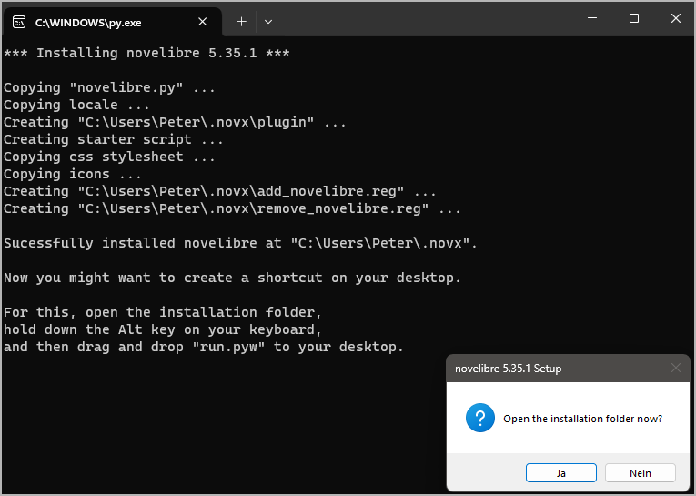

> **Wichtig**
> 
> Viele Webbrowser erkennen den Download als ausführbare Datei und
> bieten an, sie direkt zu öffnen. Damit können Sie die Installation
> ganz bequem starten.
>
> 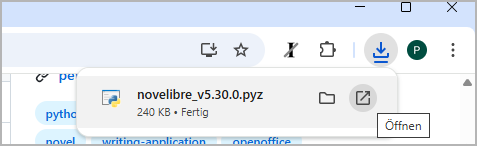
>
> Abhängig von Ihren Sicherheitseinstellungen kann es allerdings auch
> passieren, dass Ihr Browser den Download der ausführbaren Datei
> zunächst verweigert. In diesem Fall ist Ihre Bestätigung oder eine
> zusätzliche Handlung erforderlich.
>
> Falls das nicht geht, können Sie auf den Download der zip-Datei
> ausweichen. Entpacken Sie dann diese und führen Sie `setup.py` durch
> Doppelklick aus.
>
> 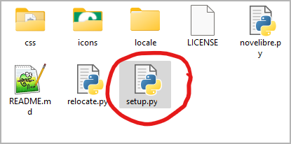

## novelibre auf den Desktop bringen

### Schritt 2

Öffnen Sie das Installationsverzeichnis.

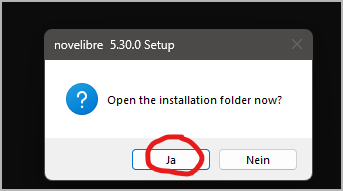

### Schritt 3

Ziehen Sie **run.pyw** bei gedrückter `Alt`-Taste auf den Desktop.
Das erzeugt eine Programmverknüpfung, um *novelibre* vom
Windows-Desktop aufzurufen. Nun können Sie *.novx*-Dateien auch auf
diese Verknüpfung ziehen.

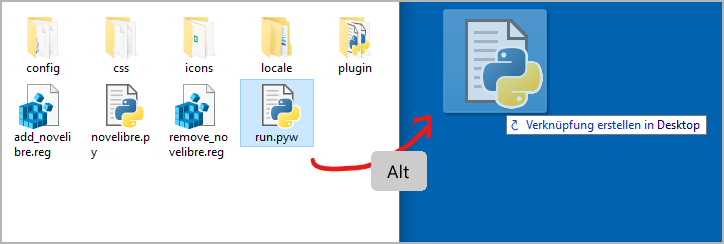

### Schritt 4

Wahlweise können Sie das "Python"-Programmsymbol durch das
*novelibre*-Logo ersetzen, das Sie im Unterverzeichnis *icons* des
Installationsordners finden.

Dazu klicken Sie mit der rechten Maustaste auf die
Programmverknüpfung und öffnen den **Eigenschaften**-Dialog. Wählen
Sie den **Verknüpfung**-Karteireiter und klicken Sie auf **Anderes
Symbol\...** (1). Im Symbolauswahldialog klicken Sie auf
**Durchsuchen\...** (2). Das öffnet einen Dateiauswahldialog. Gehen
Sie auf `<home>\.novx\icons` und doppelklicken Sie das "N"-Logo
(3).

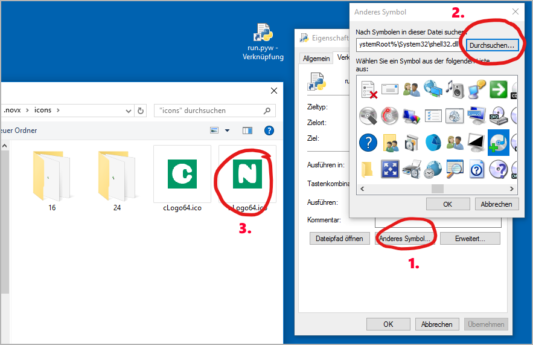

### Schritt 5

Um die Programmverknüpfung zu *novelibre* umzubenennen, klicken Sie
mit der rechten Maustaste darauf und öffnen den
**Eigenschaften**-Dialog. Im ersten Karteireiter ersetzen Sie
"Verknüpfung mit run.pyw" durch "novelibre".

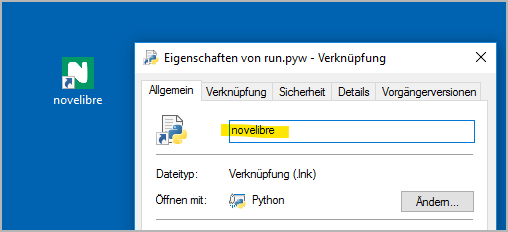

## .novx-Dateien novelibre zuweisen

### Schritt 6

Wahlweise können Sie die Dateinamenserweiterung **.novx** der
*novelibre*-Anwendung zuweisen. Dann werden Projektdateien im
Explorer mit dem *novelibre*-Symbol angezeigt und können durch
Doppelklick mit *novelibre* geöffnet werden. Außerdem können Sie
*.novx*-Dateien mit Ihrem Webbrowser betrachten, wenn Sie ein
[novx.css Stylesheet](file_menu.html#style-sheet-kopieren) im selben
Verzeichnis haben.

Doppelklicken Sie auf das Skript **add_novelibre.reg**. Windows wird
eine Warnung ausgeben und Sie um Bestätigung bitten. Falls Ihnen
Zweifel kommen, können Sie sich die Datei *add_novelibre.reg* in
einem Texteditor ansehen, oder einen Experten Ihres Vertrauens
hinzuziehen.

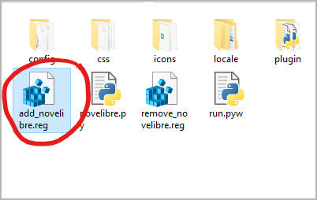

> **Hinweis**
>
> Sie können das rückgängig machen, indem Sie das Skript
> **remove_novelibre.reg** ausführen. Das entfernt alle Einträge zu
> *novelibre* aus der Windows-Registry, wobei die Anwendung erhalten
> bleibt.
>
> Um die Applikation mitsamt ihren Werkzeugen, Plugins und
> Konfigurationsdaten zu deinstallieren, löschen Sie einfach das
> Verzeichnis `<home>\.novx`, nachdem Sie das Skript
> **remove_novelibre.reg** ausgeführt haben.

> **Wichtig**
> 
> Wenn Sie *novelibre* unter Windows mit Doppelklick auf die *.novx*-Datei
> starten, ruft das unter der Motorhaube die aktuell installierte Version
> des Python-Interpreters auf.
> 
> Falls Sie zu einem späteren Zeitpunkt Ihre Python-Installation auf eine
> andere Version updaten, sollten Sie *novelibre* erneut installieren und
> danach **add_novelibre.reg** ausführen. Andernfalls wird Windows die
> neue Python-Version nicht finden, und Sie können *.novx*-Dateien nicht
> per Doppelklick öffnen.
> 
> Bitte behalten Sie das im Hinterkopf, auch wenn es reichlich
> unwahrscheinlich ist, dass *novelibre* in naher Zukunft ein
> Python-Update benötigt.

## Das Programm oder ein Plugin aktualisieren

Führen Sie einfach den Schritt 1 wie oben beschrieben aus. Sollten
weitere Handlungen nötig sein, erhalten Sie eine Meldung vom
Setup-Skript.
