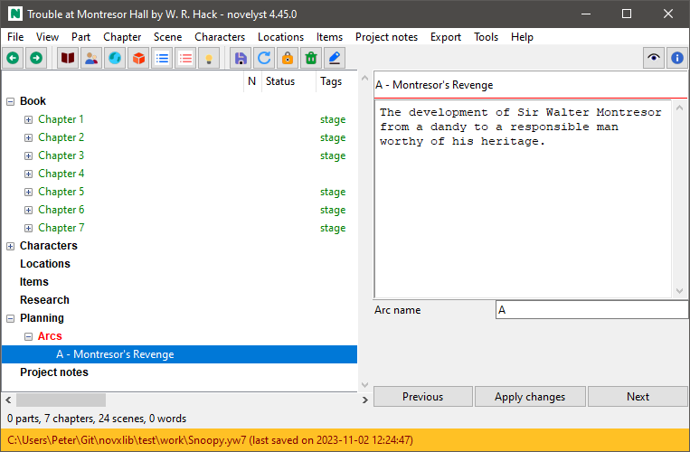
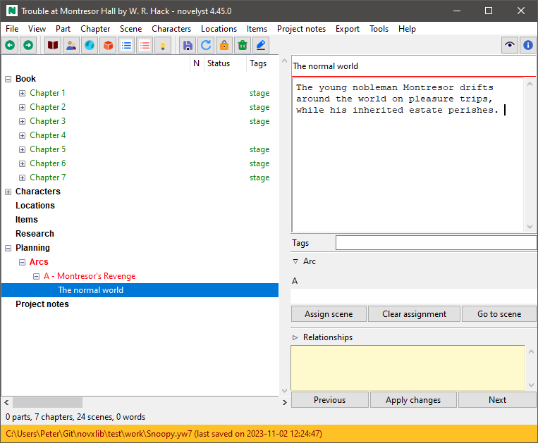
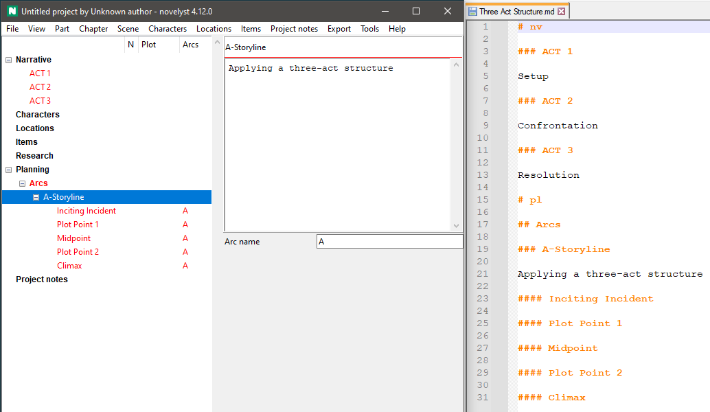

[Project homepage](../index) > [Instructions for use](../usage) > [Online help](help) > Arcs

--- 

**NOTE:** This help page applies to *novelyst* and is not yet updated for *noveltree*.

# Arcs

## What are arcs?

*noveltree* provides *arcs* as a powerful and flexible concept for plotting.

The term *plot* refers to the consequent course of the narrative action. 
"Arc" can mean a variety of things: Narrative strand, thread, character arc, storyline, sequence of cause and effect, sequence of setup and payoff, road map with milestones, and so on. You can think of an arc as a line on which points are arranged that characterize the progression of the story. These points can be assigned to sections to indicate the section's relevance to the plot. 

- *noveltree* lets you define any number of arcs. 
- Any number of sections can be assigned to each arc. 
- Any number of arcs can be assigned to each section.
- Each arc can contain any number of points. 
- Each point can be assigned to exactly one section. 

The association of sections and turning points is shown in the "Plot" column of the tree view.

## What about acts?

If you want to divide a story into phases according to a dramaturgical scheme, for example into acts or steps, arcs are not necessarily the means of choice. This is because their points have to be assigned to specific sections.
Better suited for this are "todo" type chapters, which are inserted between the regular chapters at the beginning of each phase. This gives you color-coded subheadings in the tree view, and also gives you the option of documenting your dramaturgical model in as much detail as you like, e.g. with "todo" sections underneath. 

This method can of course be combined well with turning points, which in this case can be created as plot points such as pinch point, Turning point, climax, etc.

## How to define arcs

*noveltree* implements arcs as "Todo" type chapters with an **Arc name** entry field. 

1. Create a chapter.
2. Change the chapter's type to "Todo".
3. Give the chapter a descriptive title.
4. In the right pane, type the arc's name into the **Arc name** entry. This will prefix the chapter title with the arc name. It is advised to use short arc names, for instance "A", "B", "C" for storylines, or initial letters for character arcs, etc.

**Note:** If you open a project that was created with a noveltree version older than 4.4 and that contains sections with assignments of undefined arcs, a new part named **Arcs**, containing the arc-defining chapters, is created automatically in the **Planning** branch. 

## How to group arcs

"Arc" chapters can be placed anywhere in the story. However, It is recommended to put them into "Todo" type parts, so they appear in *noveltree's* "Planning" branch. You can either create one part, called e.g. "Narrative arcs", or create any number of parts, e.g. one for character arcs, and one for setup/payoff sequences, and so on.

## How to assign sections to arcs

1. Select the section you want to assign to an arc. This can be any "normal" type section. 
2. Make sure the **Plot** window is open in the right pane. 
3. In the **Arcs** field, enter the name of the arc you want the section assign to. You can enter multiple arcs, delimiting them with semicolons. 

**Note:** You can copy/paste long arc names from the defining chapters. A more convenient way to assign sections to arcs is using the [noveltree_matrix](https://peter88213.github.io/noveltree_matrix/) plugin.

**2nd Note:** This might change in the future. 

## How to disconnect sections from arcs

1. Select the section you want to assign to an arc. This can be any "normal" type section. 
2. Make sure the **Plot** window is open in the right pane. 
3. In the **Arcs** field, remove the name of the arc you want to disconnect. Also remove the corresponding semicolon. 

**Note:** Disconnecting a section from an arc will also disconnect the corresponding turning points.

## How to delete arcs

1. Select the "Todo" chapter defining the arc you want to remove. 
2. Delete the selected chapter. Children (points) are moved to the "Trash" chapter. 

## How to rename arcs

1. Select the "Todo" chapter defining the arc you want to rename.
2. In the right pane, change the arc's name in the **Arc name** entry field. 
3. After having applied the change, you might want to edit the chapter title, removing the old arc prefix.

## How to create turning points

*noveltree* implements arcs as sections in "arc" chapters. If you add a section to an arc defining "Todo" chapter, This section is automatically assigned to the chapter's arc. 

## How to associate points with sections

1. Select the turning point you want to assign a section to. 
2. In the right pane, click **Assign section**. This starts the section picking mode, where the mouse cursor changes to a "plus" symbol in the tree view. 
3. Select the section you want to assign to the point. Clicking on any tree element ends the section picking mode. You can finish the section picking mode pressing the **Esc** key as well.   

## How to clear section associations

1. Select the turning point you want to clear its section association. 
2. Click **Clear assignment**. 

**Note** The section association is also cleared automatically if you clear the section's corresponding arc assignment.

## How to delete points

1. Select the turning point you want to delete.
2. Press the **Del** key and confirm. This clears the section assignment, if any, and moves the section to the *Trash" chapter. 

## Load and save complete narrative structures

With the [noveltree_templates plugin](https://peter88213.github.io/noveltree_templates) you can load a prefabricated story structure defined with a Markdown file. You also can save a story structure made with *noveltree* in a Markdown file for reuse.

