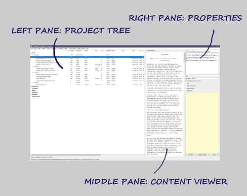

[Project homepage](../index) > [Instructions for use](../usage) > [Online help](help) > Desktop overview

--- 

# Desktop overview

The *noveltree* desktop is divided into three panes:

--- 

## Project tree

The project tree in the left pane shows the organization of the project.

- The tree elements are color-coded according to the section type (see [Basic concepts](basic_concepts)). *Normal* type sections are highlighted according to the selected coloring mode (see *Program settings* in the [View menu](view_menu)).
- The order of the columns can be changed (see *Program settings* in the [View menu](tools_menu)).
- Right-clicking on a tree element opens a [context menu](tree_context_menu) with several options. 
- The type of chapters and sections, as well as the completion status of the sections are color coded and can be changed via context menu.

---

### Project tree structure

- The **Book** branch contains the parts, chapters, and sections that belong to the novel manuscript.
- The **Characters/Locations/Items** branches contain descriptions of the story world's elements that can be associated with the book's sections.
- The **Arcs** branch contains the arcs and Turning points.
- The **Project notes** branch contains all project notes. 

---

### Project tree operation

---

#### Browse the tree

- **F2** selects a node back in the tree browsing history.
- **F3** selects a node forward in the tree browsing history.

On Windows, the "Forward" and "Back" mouse buttons (if any) may also work.

---

#### Move parts, chapters, and sections

Drag and drop while pressing the **Alt** key. Be aware, there is no "Undo" feature. 

---

#### Delete parts, chapters, and sections

Select item and hit the **Del** key.

- Parts and chapters are deleted.
- Sections are marked "unused" and moved to the "Trash" chapter. 
- Deleting a part has no effect on its subordinate chapters.
- Deleting a chapter moves its sections to the "Trash" chapter.
- The "Trash" chapter is created automatically, if needed. 
- When deleting the "Trash" chapter, all its sections are deleted.

---

## Content viewer

The **Content viewer** in the middle pane shows the part/chapter/section contents with their titles as headings.

- You can open or close the content viewer with **View > Toggle Text viewer** or **Ctrl-T**.
- On opening, the windows shows the text, where the tree is selected.
- When changing the tree selection, the text moves along.
- However, the text can be scrolled independently with the verical scrollbar, or the mousewheel. 
- You can select text with the mouse, and copy it to the clipboard with **Ctrl-C**.
- You cannot edit the text. For this, you might want to install an editor plugin, such as [noveltree_editor](https://peter88213.github.io/noveltree_editor/).
- Section text is color-coded according to the section type (see [Basic concepts](basic_concepts)).
- With the **Show markup** checkbox, XML markup can be shown/hidden.

---

## Properties

The **Properties** in the right pane show properties/metadata of the element selected in the project tree. 

- You can open or close the element properties window with **View > Toggle Properties** or **Ctrl-Alt-T**.
- On opening, the windows shows the editable properties of the selected element.
- You can detach or dock the element properties window with **View > Detach/Dock Properties** or **Ctrl-Alt-D**.
- On closing the detached window, the properties are docked again.

