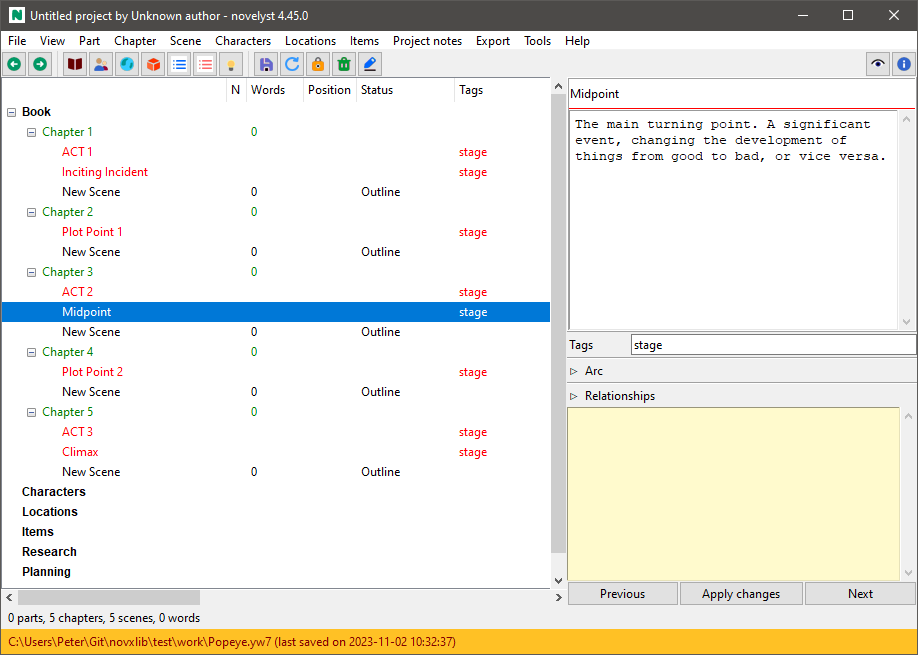
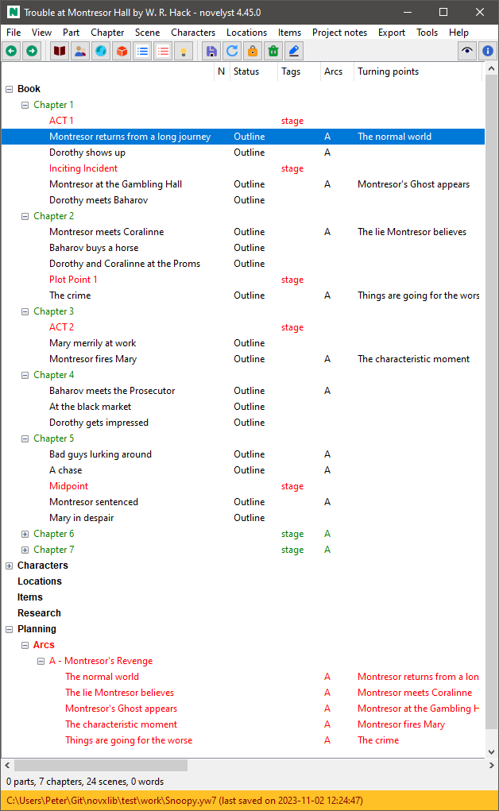
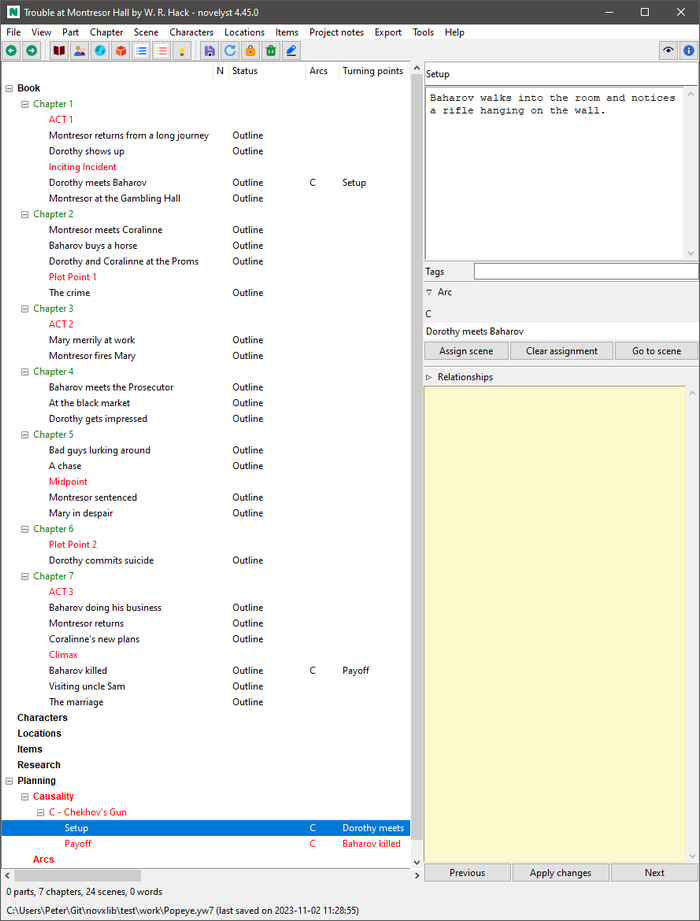

[Project homepage](../index) > [Instructions for use](../usage) > [Online help](help) > Plotting with noveltree

--- 

# Plotting with noveltree

---

## Applying a story structure model

If you want to divide a story into stages according to a structure model (e.g. the *Three Act Model*, or the *Save The Cat* beatsheet), just insert the stages between the regular scenes at the beginning of each phase. This gives you color-coded subheadings in the tree view. 

With the [noveltree_templates plugin](https://peter88213.github.io/noveltree_templates/) you can load pre-made story structure models from Markdown template files, and you can save the 
story structure of your project for reuse.

---

## Defining Arcs

*noveltree* provides *arcs* as a powerful and flexible concept for plotting.

"Arc" can mean a variety of things: Narrative strand, thread, character arc, storyline, sequence of cause and effect, sequence of setup and payoff, and so on. You can think of an arc as a line on which turning points are arranged that characterize the progression of the story. These turning points can be assigned to scenes to indicate the scene's relevance to the plot. 

- *noveltree* lets you define any number of arcs. 
- Any number of scenes can be assigned to each arc. 
- Any number of arcs can be assigned to each scene.
- Each arc can contain any number of turning points. 
- Each turning point can be assigned to exactly one scene. 

The association of scenes and turning points is shown in the "Plot" column of the tree view.

You can use arcs to establish named connections between scenes, such as *setup -> payoff*, so you can keep track of this relationship even if the scenes are far away from each other.

---

