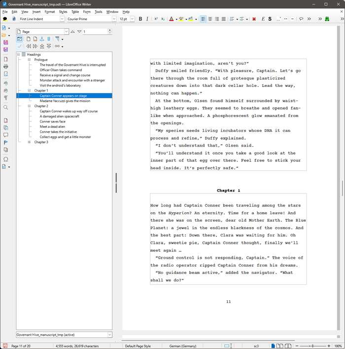

[Home page](https://github.com/peter88213/novelibre) > German page

---

#  novelibre (Deutsche Seite)

[novelibre](https://github.com/peter88213/novelibre/) hilft Romanautoren dabei, 
umfangreiche Romane zu planen und während des Schreibens und Überarbeitens 
den Überblick zu behalten.  
*novelibre* ist für Autoren gedacht, die mit LibreOffice oder OpenOffice vertraut sind.  
*novelibre* ist eine Ergänzung zu OpenOffice oder LibreOffice, die dabei hilft, 
umfangreiche Romane in Teile, Kapitel und Abschnitte zu unterteilen, die alle mit 
zusätzlichen Informationen, sogenannten Metadaten, versehen sind.  
Die Metadaten bleiben während der gesamten Arbeit an dem Roman dauerhaft mit 
den Kapiteln und Abschnitten im ODT-Manuskript verknüpft. 
*novelibre* macht Informationen über die Erzählwelt zugänglich und verknüpft Figuren, 
Schauplätze und Gegenstände mit den Abschnitten.
*novelibre* kann Informationen über Plotlinien und Plotpunkte erfassen, die 
den Abschnitten zugeordnet sind.

[Erfahren Sie mehr](https://peter88213.github.io/nvhelp-de/introduction.html) 
über die Idee und den Zweck von novelibre. 

So sieht der Arbeitsbereich von *novelibre* aus:

Dies ist das Manuskript, an dem gearbeitet werden soll. 
*novelibre* hat es erstellt und an LibreOffice *Writer* weitergereicht:

Wenn die Systemsprache Ihres Computers Deutsch ist, erscheinen die Benutzeroberfläche 
und die Online-Hilfe von *novelibre* ebenfalls in deutscher Sprache. 
Das Benutzerhandbuch liegt komplett auf Deutsch vor. 

---

## Links

- [Benutzerhandbuch](https://peter88213.github.io/nvhelp-de/) 
- [Download-Seite (Englisch)](https://github.com/peter88213/novelibre) 
- [Feedback geben oder eine Frage stellen (Englisch)](https://github.com/peter88213/novelibre/discussions)

---

## Lizenz

Dies ist Open Source Software, und *novelibre* steht unter der GPLv3-Lizenz. 
Einzelheiten finden Sie auf der
[GNU General Public License website](https://www.gnu.org/licenses/gpl-3.0.en.html), 
oder in der [LICENSE](https://github.com/peter88213/novelibre/blob/main/LICENSE)-Datei.

