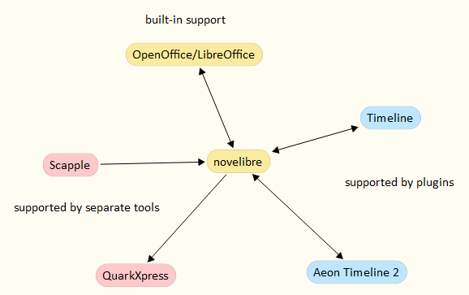

[Homepage](https://github.com/peter88213/novelibre) > German page

---

#  novelibre - German page

[novelibre](https://github.com/peter88213/novelibre/) helps novelists to plan extensive novels and to keep track of them during creation and revision.

*novelibre* ist für Autoren gedacht, die mit LibreOffice oder OpenOffice vertraut sind. 

*novelibre* ist eine Ergänzung zu OpenOffice oder LibreOffice, die dabei hilft, umfangreiche Romane in Teile, Kapitel und Abschnitte zu unterteilen, die alle mit zusätzlichen Informationen, sogenannten Metadaten, versehen sind.

Die Metadaten bleiben während der gesamten Arbeit an dem Roman dauerhaft mit den Kapiteln und Abschnitten im ODT-Manuskript verknüpft. 
*novelibre* macht Informationen über die Erzählwelt zugänglich und verknüpft Figuren, Schauplätze und Gegenstände mit den Abschnitten.
*novelibre* kann Informationen über Plotlinien und Plotpunkte erfassen, die den Abschnitten zugeordnet sind.

[Erfahren Sie mehr](https://peter88213.github.io/nvhelp-de/introduction.html) 
über die Idee und den Zweck von novelibre. 

So sieht der Arbeitsbereich von *novelibre*aus:

Dies ist das Manuskript, an dem gearbeitet werden soll. 
*novelibre* hat es erstellt und an LibreOffice *Writer* weitergereicht:

![LibreOffice screenshot]Screenshots/screen02.jpg)

Was *novelibre* von anderer Schreibsoftware unterscheidet, ist die Integration 
anderer Anwendungen in den Arbeitsablauf, die leistungsstark und bewährt sind. 
*novelibre* ist keine „All-in-One”-Lösung, sondern ein Roman-Organizer, der
in ein anpassbares Ökosystem eingebettet ist. 

- [Benutzerhandbuch](https://peter88213.github.io/nvhelp-de/) 
- [Homepage (Englisch)](https://github.com/peter88213/novelibre) 
- [Feedback geben oder eine Frage stellen (Englisch)](https://github.com/peter88213/novelibre/discussions)

---

