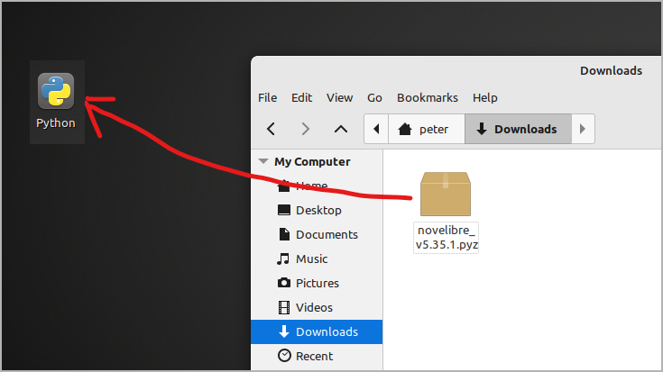
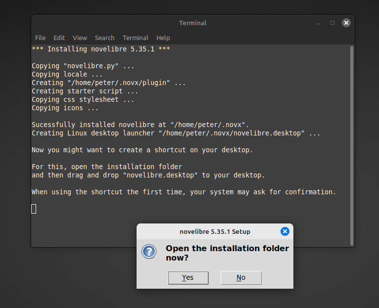
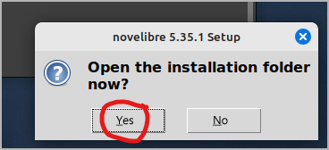
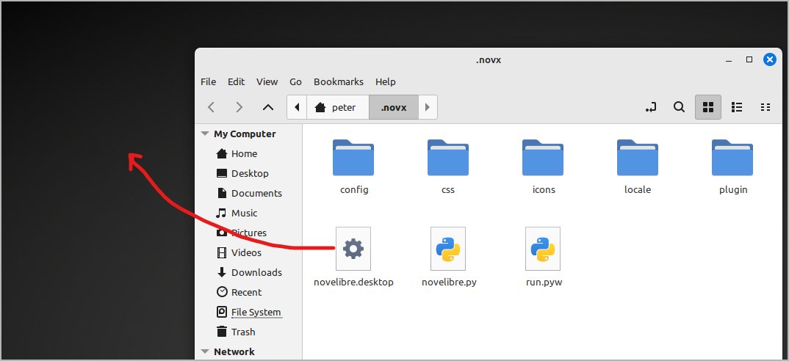
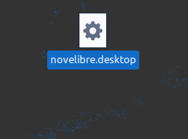
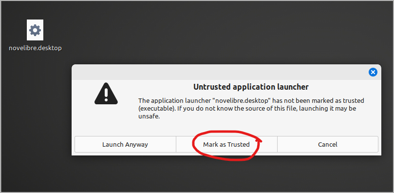
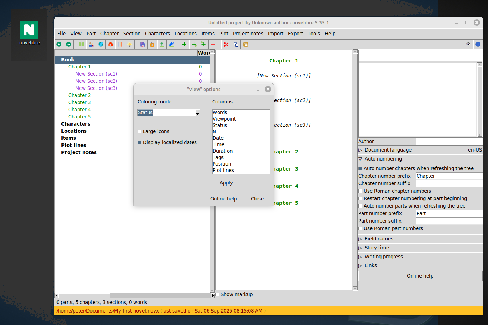
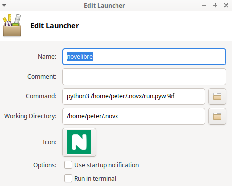

- [Home page](https://github.com/peter88213/novelibre) 
- [novelibre User guide](https://peter88213.github.io/nvhelp-en/)

[Deutsch](../de/setup_linux)

------------------------------------------------------------------------

# Installation under Linux

> **Important**
>
> You receive *novelibre* as source code in the *Python* programming
> language. Most Linux distributions have Python installed, which is
> necessary to execute the program. However, make sure you have Python
> version 3.7 or higher. If this is not the case, it would be a good
> reason to update your distribution.

Before you can install *novelibre* on **Linux** you must ensure that the
prerequisites mentioned on the project home page are met. In particular,
support for *tkinter* must be installed on your system. For Ubuntu, the
package is called **python3-tk** for example, for Fedora it may be
**python3-tkinter**.

Just lauch your package manager and look for the corresponding package.
Here is an example for Linux Mint:

If necessary, have this package installed before starting the
*novelibre* installation.

The actual installation of *novelibre* is simple and straightforward.
The installation program automatically creates an installation
directory, copies everything necessary into it, and generates a start
file named **run.pyw** adapted for the respective computer, which must
be called in order to execute *novelibre*.

The necessary manual work consists of linking this start file to the
desktop.

## Installing the application

### Step 1

- Either drag/drop the downloaded **novelibre_vx.x.x.pyz** onto
  the Python application launcher,

  

- or open a console window in the Download folder and execute
  `python3 novelibre_vx.x.x.pyz` on the command line.

  

*"x.x.x"* means the version number.

In both cases, a success message should appear.

 
> **Hint**
>
> If you have not set up a Python application launcher, you can
> download the one I'm providing on the *novelibre* home page. Place
> it either on your Linux desktop or in the download folder. This is
> worthwhile with regard to the installation of plugins and updates.

## Making novelibre accessible on the Desktop

### Step 2

Open the installation folder.

### Step 3

Drag and drop **novelibre.desktop** onto the desktop.

This creates a launcher to start *novelibre* from the desktop.

### Step 4

When you click (or double-click) for the first time, a warning
message may appear to prevent you from accidentally installing an
executable file.

If you mark the application launcher as trusted, the icon in Linux
Mint will change to the *novelibre* program logo, and you can start
the application by clicking on it.

Now you can also drag and drop *.novx* project files onto this
shortcut.

> **Hint**
> 
> If the steps 2 and 3 wouldn't work on your Linux desktop, you will have
> to set up a application launcher yourself. This is a matter of calling
> **python3** with **/home/your-username/.novx/run.pyw** and an optionally
> specified file as parameters. You get a desktop icon to click on and to
> open your *.novx* project file via drag-and-drop.
> 
> With the XFCE desktop, for example, my launcher command is:
> 
> `python3 /home/peter/.novx/run.pyw %f`
> 
> 
> 
> You might have to copy the *novelibre* icons to a dedicated image
> directory where your application launcher gets the icons from. You also
> may want to set *novelibre* as standard application for files with the
> *.novx* extension, and assign them the *novelibre* logo as file icon.
> 
> If you succeed, feel free to share your experience in the [novelibre
> "Discussions" forum](https://github.com/peter88213/novelibre/discussions)

### Step 5

It's a good idea to register the *novx* extension in the mimetypes
as **text/xml**, so it can be opened with your web browser for
display, using the [novx.css style
sheet](file_menu.html#copy-style-sheet).

## Updating the application or a plugin

Just execute the first step as described above. If there is any further
action required, the setup script will give you a message.
