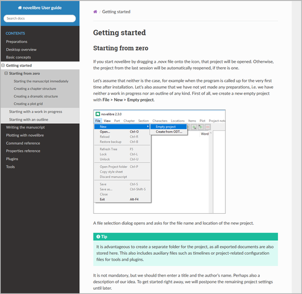

[Project homepage](../) > Instructions for use

--- 

The *noveltree* Python program provides a tree view for novels written with LibreOffice or OpenOffice.

# Instructions for use

## Installation

- Unzip the downloaded zipfile.
- Move into the unzipped folder and launch **setup.pyw**. This installs the application for the local user.
- Create a shortcut on the desktop when asked.
- Optionally, you can replace the "Python" icon by the *noveltree* logo you may find in the installation's **icons** subdirectory.

---

### Windows integration

After installation, the setup script displays a button to open the installation directory. On Windows, the path is typically

`C:\Users\<username>\.noveltree`

There you will find some registry scripts that can help you integrate *noveltree* into Windows. They are started by double-clicking.

- **add_noveltree.reg** makes Explorer launch *noveltree* when you double-click *.novx* files. *.novx* files will be assigned the *noveltree* icon. *.novx* files will be assigned the content type "text/xml" This may be necessary if you want to view *.novx* files with a web browser. 

You can redo this:

- **remove_noveltree.reg** removes the registry entries made for the *.novx* file type. 

--- 

### Linux desktop integration

- You can configure a desktop launcher for *noveltree* and assign the *noveltree* icon you may find in the installation's **icons** subdirectory.
- You can set *noveltree* as the default application for *.novx* files.
- If you want to view *.novx* files with your web browser, it is recommended to register the *MIME type* of *.novx* files as *"text/xml"*.

Please refer to your desktop's documentation. 

---

## Launch the program

The included installation script prompts you to create a shortcut on the desktop. 

You can either

- launch the program by double-clicking on the shortcut icon, or
- launch the program by dragging a *.novx* project file and dropping it on the shortcut icon.

--- 

# [Online help](https://peter88213.github.io/nvhelp-en/index.html)

You can open the online help page with **Help > Online help**.

--- 

# License

This is Open Source software, and *noveltree* is licensed under GPLv3. See the
[GNU General Public License website](https://www.gnu.org/licenses/gpl-3.0.en.html) for more
details, or consult the [LICENSE](https://github.com/peter88213/noveltree/blob/main/LICENSE) file.

